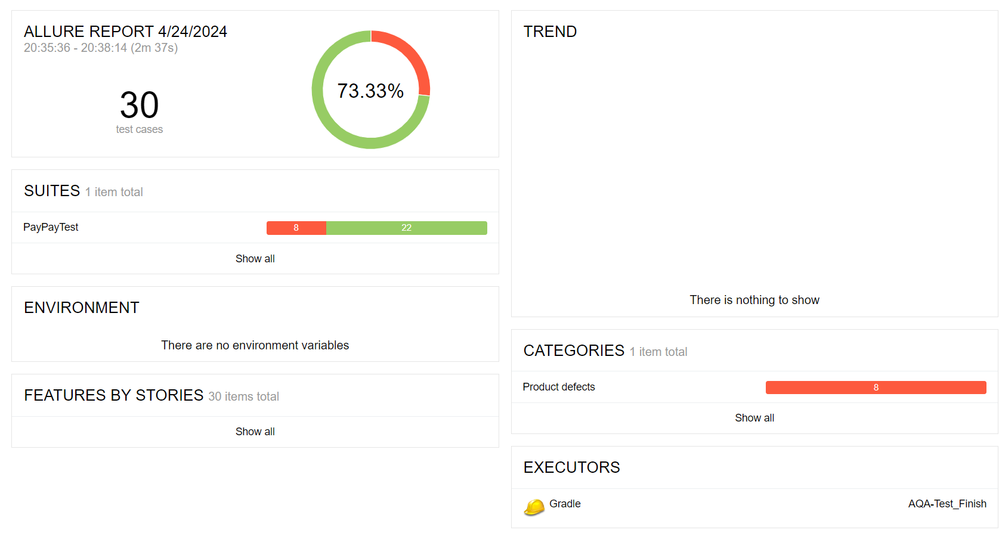
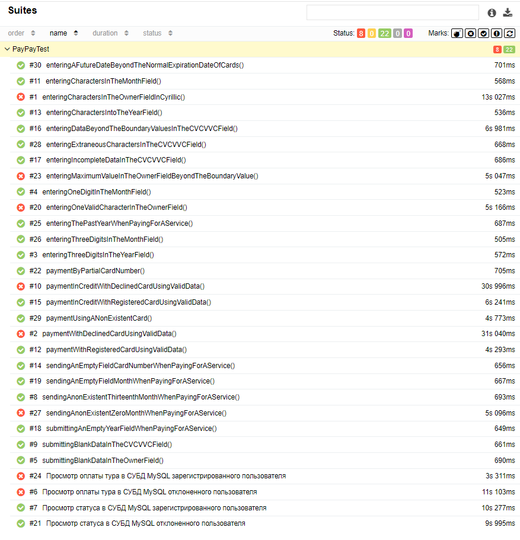

# Отчётные документы по итогам тестирования
### При проведении автоматизированного тестирования было реализовано 30 сценариев:
- 26 автоматизиринованных тестов *(UI)*;
- 4 автоматизированных теста на проверку занесения данных в СУБД MySQL;

__Из них 73,3% успешных теста - 26,7% проваленных.__     

    
   

### В результате проведения тестирования было занесено 9 баг-репортов:
- 6 дефектов в результате тестирования веб-сайта;
- 2 дефекта в результате тестирования на занесение данных в СУБД MySQL;
- 1 дефект в результате ручного тестирования.  
  Все баг-репорты задокументированы Issue репозитария проекта на GitHub.

### Общие рекомендации:
***Следует в первую очередь обратить внимание на то, что приложение списывает сумму в 10 раз больше, чем указано на сайте.  
Также обратить внимание, что не проработан отказ при вводе отклоненной карты.***  
Из остальных дефектов следует:
- настроить поле ввода "Месяц" - отсутствует блокатор на ввод 00;
- настроить поле ввода "Владелец" - отсутствие граничных значений,
  отсутствие блокаторов на ввод посторонних символов(кроме латиницы);
- Исправить грамматическу ошибку в названии города(Исправить на "Марракеш").